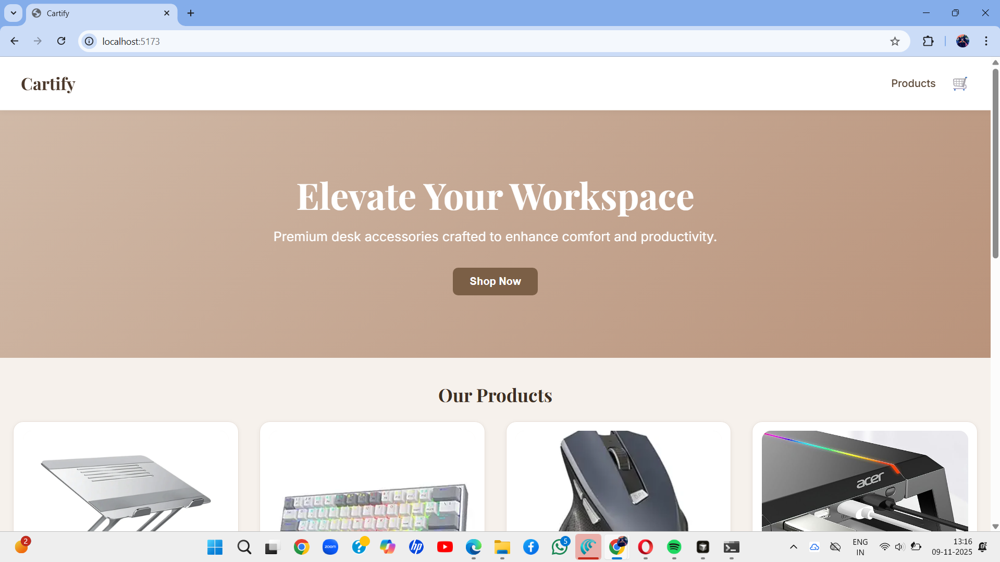
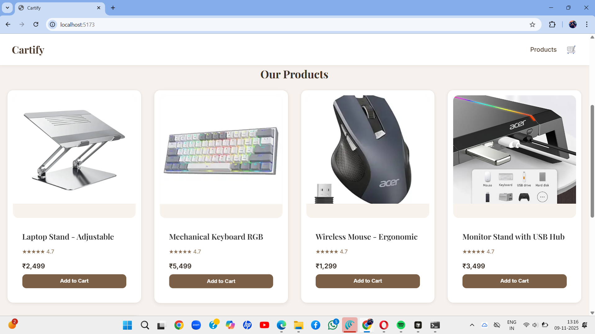
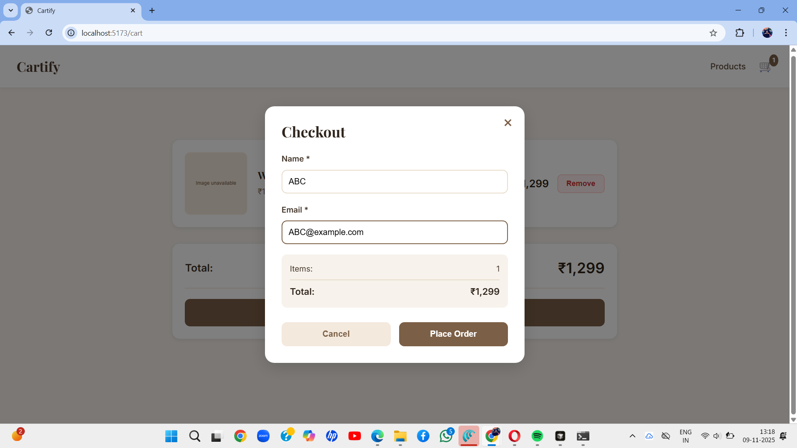
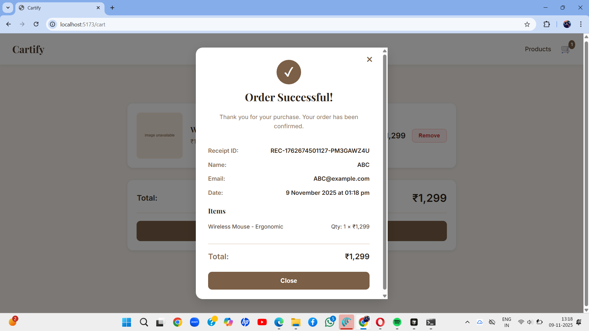

# Mock E-Com Cart

A full-stack e-commerce shopping cart application built with React (Vite) and Node.js (Express).

## 🚀 Features

- Browse products in a responsive grid
- Add/remove items from cart
- Update item quantities
- Checkout with name and email
- View order receipt
- Clean, modern UI with responsive design

## 📁 Project Structure

```
mock-ecom-cart/
├── backend/
│   ├── package.json
│   ├── server.js          # Express server with REST APIs
│   └── products.json      # Mock product data
├── frontend/
│   ├── package.json
│   ├── vite.config.js
│   ├── index.html
│   └── src/
│       ├── main.jsx       # React entry point
│       ├── App.jsx        # Main app component
│       ├── api.js         # API utility functions
│       ├── styles.css     # Global styles
│       └── components/
│           ├── ProductsGrid.jsx
│           ├── Cart.jsx
│           └── CheckoutModal.jsx
└── README.md
```

## 🛠️ Tech Stack

- **Frontend**: React 18, Vite
- **Backend**: Node.js, Express (ESM modules)
- **Storage**: In-memory (Map-based)
- **Communication**: REST APIs

## 📦 Installation

### Backend Setup

```bash
cd backend
npm install
npm start
```

Backend runs on `http://localhost:3000`

### Frontend Setup

```bash
cd frontend
npm install
npm run dev
```

Frontend runs on `http://localhost:5173`

## Screenshots






## 🔌 API Endpoints

### GET /api/products
Returns all available products.

### GET /api/cart
Returns the user's cart (requires `x-user-id` header).

### POST /api/cart
Add or update item in cart.
- Body: `{ productId, qty }`
- Requires `x-user-id` header

### DELETE /api/cart/:id
Remove item from cart.
- Requires `x-user-id` header

### POST /api/checkout
Process checkout and clear cart.
- Body: `{ name, email }`
- Requires `x-user-id` header
- Returns receipt with order details

## 💡 Usage

1. Start the backend server
2. Start the frontend development server
3. Open `http://localhost:5173` in your browser
4. Browse products and add them to cart
5. Update quantities or remove items
6. Click "Proceed to Checkout" to place an order

## 📝 Notes

- User ID is automatically generated and stored in localStorage
- Cart data is stored in-memory (will be cleared on server restart)
- All prices are displayed in INR (₹)

## 🔮 Future Enhancements

- MongoDB or SQLite database integration
- User authentication
- Order history
- Product search and filters
- Payment integration

